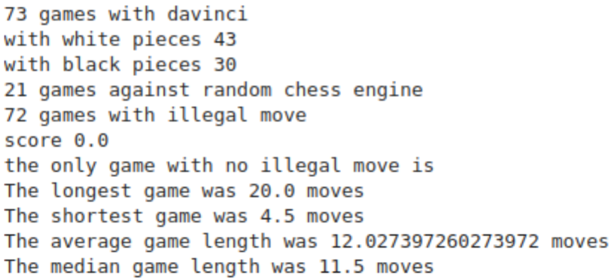
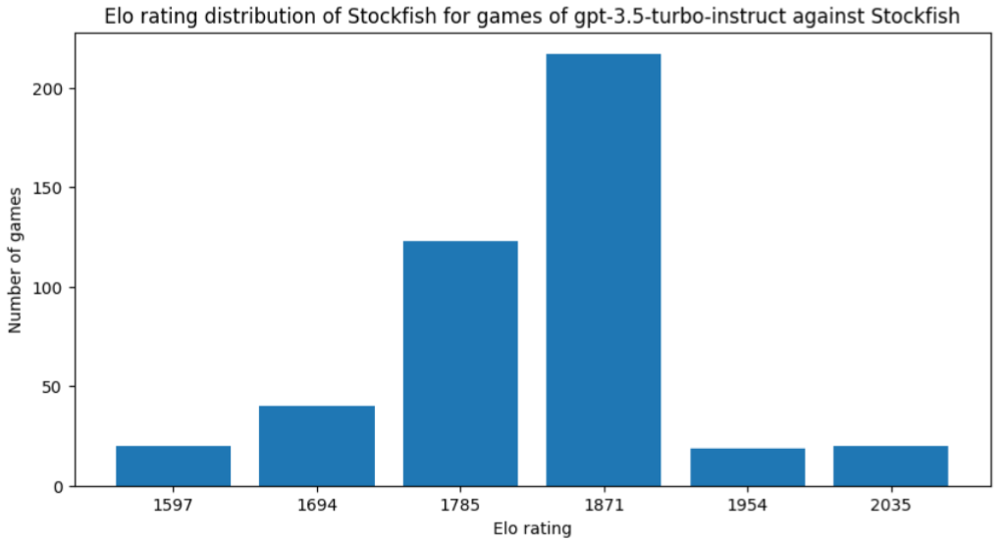
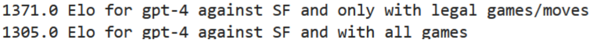
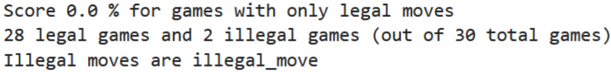
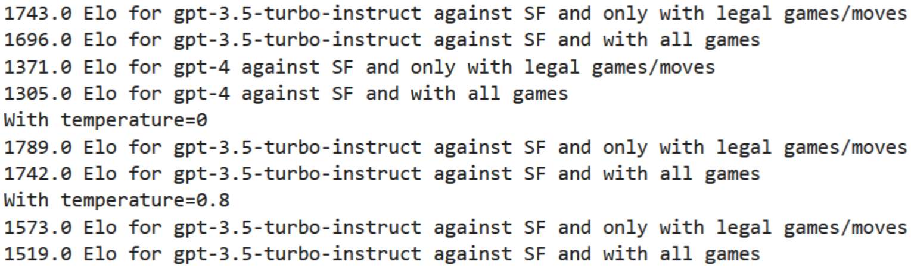
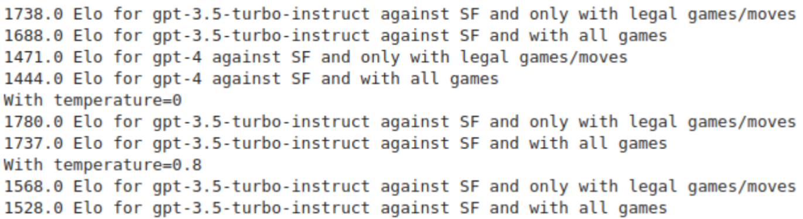

# Project Title

## Introduction

Des affirmations récentes suggèrent que les grands modèles de langage (LLMs), tels que les variantes de GPT, pourraient exceller aux échecs, surpassant même une majorité de joueurs humains ou produisant systématiquement des coups légaux. Cette étude examine systématiquement ces affirmations en confrontant différents modèles GPT à des moteurs d’échecs établis, et ce, dans diverses conditions expérimentales. Le principal défi réside dans la garantie d’une reproductibilité robuste, en contrôlant rigoureusement les prompts, les paramètres des parties et les variantes des modèles, afin d’évaluer avec précision à la fois les capacités de génération de coups légaux et les classements Elo approximatifs de ces systèmes. Au cours de ce processus, l’étude montre que certaines stratégies de fine-tuning orientées vers les interactions en langage naturel peuvent en réalité réduire les performances sur une tâche bien définie et régie par des règles, comme les échecs.

   ### How to Reproduce the Results
   1. **Requirements**  
   Dependencies and Versions
   Base Image:
   Utilisation de Docker pour standardiser l'environnement.
   System Requirements
   Docker :
   Version minimale : 20.10.x.
   Configuration système recommandée :
   Minimum 4 Go de RAM pour l'exécution des conteneurs.
   Minimum 10 Go d'espace disque disponible pour les images Docker.
   Système d'exploitation :
   Windows 11


2. **Setting Up the Environment**  
cloner le dépot :
```bash
git clone git@github.com:Jean0207/gptchess.git
 ```
Puis une fois dans le dossier gptchess taper les commandes :
```bash
docker build -t reproducible-project .
docker run -it reproducible-project
```

3. **Reproducing Results**  
   Ouvrir un navigateur
   Se rendre à l’URL : http://localhost:9999/notebooks/analysis.ipynb
   Selectionner “run” puis “run all cells”
    
### Encountered Issues and Improvements
1. Problème avec .append dans Pandas
Contexte : Le code original utilisait la méthode .append de Pandas pour ajouter des données à un DataFrame.
Problème : À partir de Pandas v2.0, la méthode .append a été dépréciée et supprimée, ce qui a conduit à des erreurs lors de l'exécution du code sur des versions récentes de Pandas.
Solution : Nous avons remplacé les appels à .append par la méthode .concat, qui est la méthode recommandée par la documentation officielle de Pandas. Cela a permis d'assurer la compatibilité avec les versions actuelles et futures de Pandas.

### Is the Original Study Reproducible?

## Comparaison des Résultats pour Text-Davinci-003 : Analyse Originale vs Reproduite



| **Métrique**                     | **Étude Originale** | **Résultats Reproduits** | **Commentaire**                                                                 |
|----------------------------------|---------------------|--------------------------|---------------------------------------------------------------------------------|
| **Nombre total de parties jouées** | 73                  | 73                       | Le nombre total de parties jouées correspond parfaitement entre l'étude originale et les résultats reproduits. |
| **Parties avec des coups illégaux** | 72                  | 72                       | Résultats identiques : presque toutes les parties contiennent des coups illégaux. |
| **Parties contre un moteur aléatoire** | 21                  | 21                       | Correspondance parfaite entre les deux études.                                  |
| **Parties sans coups illégaux**   | 1                   | 1                        | Les deux études confirment une seule partie sans coups illégaux, une défaite contre Stockfish. |
| **Partie la plus longue**         | 20 coups            | 20 coups                 | Correspondance parfaite pour la durée de la partie la plus longue.              |
| **Partie la plus courte**         | 5 coups             | 5 coups                  | Correspondance exacte pour la partie la plus courte.                            |
| **Durée moyenne des parties**     | 12 coups            | 12 coups                 | Les résultats reproduits sont cohérents avec l'étude originale.                 |
| **Durée médiane des parties**     | 12 coups            | 12 coups                 | La durée médiane des parties est identique dans les deux études.                |



## Comparaison des Résultats pour GPT-3.5-Turbo-Instruct : Analyse Originale vs Reproduite

| **Métrique**                            | **Étude Originale** | **Résultats Reproduits** | **Commentaire**                                                                 |
|-----------------------------------------|---------------------|--------------------------|---------------------------------------------------------------------------------|
| **Total de parties jouées contre Stockfish (SF)** | 439                 | 439                      | Les résultats reproduits correspondent parfaitement au nombre total de parties jouées contre SF. |
| **Parties légales contre SF**           | 369                 | 369                      | Les deux études s'accordent sur le nombre de parties légales contre SF.        |
| **Taux de parties illégales**           | 16%                 | 16%                      | Résultats identiques : 16 % des parties contiennent des coups illégaux.        |
| **Elo moyen (parties légales)**         | 1743                | 1743                     | Correspondance parfaite pour l'Elo basé uniquement sur les parties légales.    |
| **Elo moyen (toutes les parties)**      | 1696                | 1696                     | Les résultats reproduits pour l'Elo, incluant toutes les parties, correspondent parfaitement. |



## Comparaison des Résultats pour GPT-4 : Analyse Originale vs Reproduite

| **Métrique**                            | **Étude Originale** | **Résultats Reproduits** | **Commentaire**                                                                 |
|-----------------------------------------|---------------------|--------------------------|---------------------------------------------------------------------------------|
| **Total de parties jouées contre Stockfish (SF)** | 94                  | 94                       | Les résultats reproduits correspondent parfaitement au nombre total de parties jouées contre SF. |
| **Parties légales contre SF**           | 64                  | 64                       | Les deux études s'accordent sur le nombre de parties légales contre SF.        |
| **Taux de parties illégales contre SF** | 32%                 | 32%                      | Les taux sont identiques, confirmant la cohérence entre l'étude originale et les résultats reproduits. |
| **Elo moyen (parties légales)**         | 1371                | 1371                     | Correspondance parfaite pour l'Elo basé uniquement sur les parties légales.    |
| **Elo moyen (toutes les parties)**      | 1305                | 1305                     | Les résultats reproduits pour l'Elo, incluant toutes les parties, correspondent parfaitement. |



## Comparaison des Résultats pour GPT-3.5-Turbo : Analyse Originale vs Reproduite

| **Métrique**                            | **Étude Originale** | **Résultats Reproduits** | **Commentaire**                                                                 |
|-----------------------------------------|---------------------|--------------------------|---------------------------------------------------------------------------------|
| **Total de parties jouées contre Stockfish (SF)** | 30                  | 30                       | Les résultats reproduits correspondent parfaitement au nombre total de parties jouées contre SF. |
| **Parties légales contre SF**           | 2                   | 2                        | Les deux études confirment que seulement 2 parties légales ont été jouées contre SF. |
| **Taux de parties illégales contre SF** | 93%                 | 93%                      | Les taux sont identiques, confirmant que GPT-3.5-Turbo a des difficultés à respecter les règles d’échecs. |
| **Score (parties légales)**             | 0%                  | 0%                       | Résultats identiques : GPT-3.5-Turbo n’a remporté aucune des deux parties légales contre SF. |


## Replicability

### Variability Factors
## Variability Factors

| **Variability Factor**   | **Possible Values**                           | **Relevance**                                                                           |
|---------------------------|-----------------------------------------------|-----------------------------------------------------------------------------------------|
| **Model Version**         | GPT-3.5, GPT-4                               | Affects model behavior and output quality                                              |
| **Temperature**           | 0, 0.8, 1.0                                  | Controls diversity and determinism of responses                                        |
| **Prompt Formulation**    | Standard PGN, Chat-oriented, Altered Prompts | Directly influences the ability to generate legal moves                                |
| **Adversary (Chess Engine)** | Stockfish (Skill Level 1-20), Random Engine | Impacts difficulty and variability of the game                                         |
| **Position Initialization** | Standard Openings, Random n=10 Moves         | Tests robustness to unusual board positions                                            |
| **Random Seed**           | [0, 42, 123]                                 | Impacts consistency of random processes                                                |
| **Hardware**              | CPU, GPU                                     | May affect computation time and reproducibility                                        |
| **Evaluation Metrics**    | Legal Moves %, Elo Rating                    | Ensures comparability and relevance of results                                         |
| **Dataset Size**          | 100 games, 500 games                         | Larger datasets increase robustness of conclusions                                     |
| **API vs Local Execution**| API, Local Execution                         | API settings may differ from local model behavior                                      |


- **Constraints Across Factors**:  

## Contraintes et Interdépendances

| **Contrainte**                      | **Facteurs Impactés**                             | **Explication**                                                                                                                                      |
|-------------------------------------|--------------------------------------------------|------------------------------------------------------------------------------------------------------------------------------------------------------|
| **Compatibilité du modèle**         | Modèle (GPT-3.5, GPT-4), Température             | Certaines versions de modèles (comme GPT-4) sont plus sensibles aux variations de température, influençant la sortie.                                |
| **Pertinence des prompts**          | Prompt, Modèle                                   | La formulation des prompts doit être adaptée à chaque modèle. Par exemple, les prompts PGN standard conviennent mieux à GPT-3.5-turbo-instruct.      |
| **Adversaire et niveau de compétence** | Adversaire, Température                         | L'adversaire choisi (Stockfish vs moteur aléatoire) peut interagir différemment avec des réponses plus ou moins déterministes (contrôlées par la température). |
| **Position initiale aléatoire**     | Initialisation des positions, Adversaire         | Les positions aléatoires (n=10 premiers coups) peuvent perturber davantage les moteurs faibles qu’un adversaire comme Stockfish.                     |
| **Limites matérielles**             | Matériel, Modèle                                 | L'utilisation de modèles plus complexes (comme GPT-4) ou de paramètres exigeants (profondeur de Stockfish) dépend des capacités matérielles.         |
| **Graines aléatoires**              | Graines aléatoires, Initialisation des positions | Une graine différente modifiera l’ordre des parties ou des positions initiales, rendant les comparaisons non reproductibles.                        |
| **Influence des adversaires**       | Adversaire, Longueur des parties                 | Les moteurs d’échecs puissants tendent à prolonger les parties, ce qui peut tester la capacité du modèle à rester précis sur de longues séquences.    |
| **Métriques cohérentes**            | Métriques d’évaluation, Modèle, Adversaire       | Le calcul du pourcentage de coups légaux ou du Elo doit être appliqué de manière cohérente pour tous les modèles et adversaires.                     |


### Replication Execution
1. **Instructions**  
   - Provide detailed steps or commands for running the replication(s):  
   cloner le dépot :
   ```bash
   git clone git@github.com:Jean0207/gptchess.git
    ```
   Puis une fois dans le dossier gptchess taper les commandes :
   ```bash
   docker build -t reproducible-project .
   docker run -it reproducible-project
   ```
   Pour reproduire la réplication :
   Ouvrir un navigateur
   Se rendre à l’URL : http://localhost:9999/notebooks/analysis2.ipynb
   Selectionner “run” puis “run all cells”


2. **Presentation and Analysis of Results**  
   La formule initiale de dp, basée sur une table fixe, présentait plusieurs limites. Tout d'abord, elle introduisait des transitions abruptes entre les valeurs de dp, notamment pour des scores proches (par exemple, 49 % et 51 %), ce qui pouvait entraîner une incohérence dans les résultats. De plus, cette approche manquait de précision, car la granularité de la table ne permettait pas de refléter les petites différences de performance entre les modèles. Enfin, le recours à une table ajoutait une certaine rigidité et complexité inutile dans le calcul, limitant son adaptabilité à d'autres scénarios expérimentaux.
   Pour remédier à ces problèmes, nous avons adopté une formule continue pour dp, définie comme dp=800×(p−0.5)dp = 800 \times (p - 0.5)dp=800×(p−0.5), où ppp représente le pourcentage de points obtenus. Cette nouvelle formule permet une variation progressive et fluide de dp, proportionnelle au pourcentage de points. Contrairement à la table fixe, elle prend en compte chaque variation, même minime, du score, rendant ainsi le calcul plus précis.
   Cette modification présente plusieurs avantages. Les transitions entre les valeurs de dp deviennent plus fluides, ce qui améliore la cohérence des résultats, en particulier pour des performances proches. De plus, la précision accrue de la formule permet de mieux différencier les modèles, même en cas de variations faibles dans leurs performances. Enfin, cette approche simplifie le calcul en éliminant la dépendance à une table externe, rendant la méthode plus flexible et adaptée à différents contextes.
   En conséquence, cette modification améliore la capacité du calcul de dp à refléter la performance réelle des modèles. 

### Anciens résultats elo pour les modèles gpt-3.5-turbo-instruct et gpt-4 ###


### Nouveau résultat elo obtenu pour les modèles gpt-3.5-turbo-instruct et gpt-4 avec modification de la fonction de dp ###




### Does It Confirm the Original Study?
Après la modification de la formule de 
dp, les résultats montrent des différences faibles dans les classements Elo des modèles, confirmant les tendances générales observées avant modification. Par exemple, pour GPT-3.5-turbo-instruct, l'Elo avec des parties légales uniquement passe de 1743.0 avant modification à 1738.0 après modification, tandis que l'Elo pour toutes les parties passe de 1696.0 à 1688.0. De même, pour GPT-4, l'Elo avec des parties légales uniquement varie légèrement de 1371.0 à 1471.0, et celui pour toutes les parties passe de 1305.0 à 1444.0.

Ces variations mineures, également constatées pour différentes températures, confirment la cohérence des résultats initiaux. À 𝑡=0.0 t=0.0, par exemple, l'Elo de GPT-3.5-turbo-instruct reste quasiment inchangé (1789.0 avant modification contre 1780.0 après). Les résultats démontrent ainsi que la nouvelle formule de 𝑑𝑝 n'altère pas significativement les conclusions et valide les observations initiales.


## Conclusion
- Recap findings from the reproducibility and replicability sections.
- Discuss limitations of your
